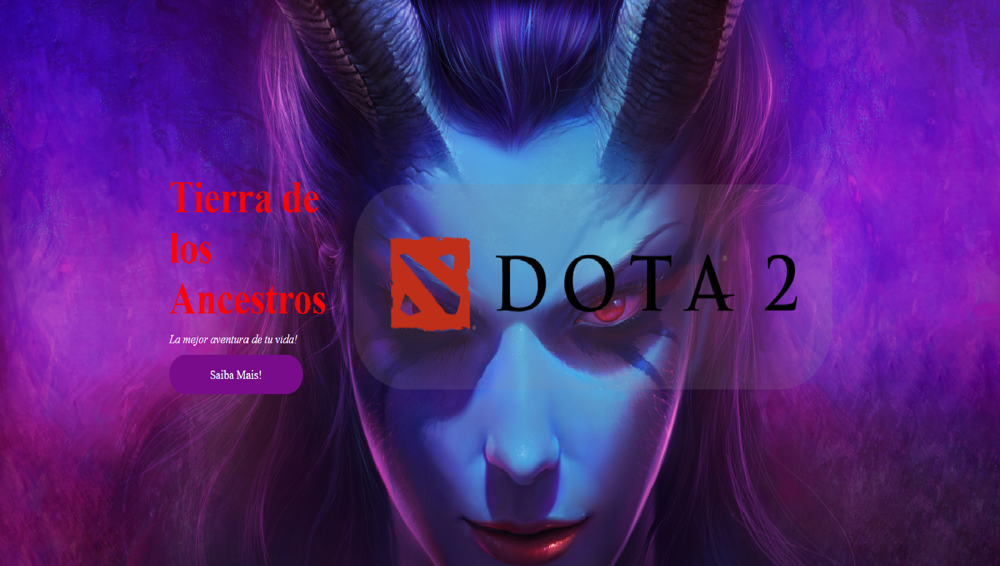
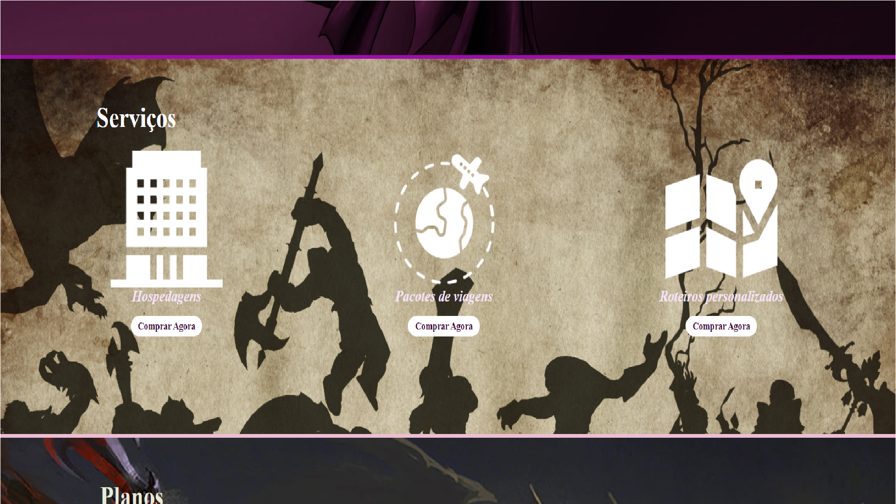

# Dota 2 Interface Web
Esse modelo de interface web é uma simulação de um serviço virtual, tematico com o universo do jogo Dota 2.
foram utilizadas diferentes aspectos de responsibidade, para tela de pc e na modalidade Mobile 920px.
As linguagens utilizadas foram:
- HTML
- CSS 

A apresentação da pagina tem um menu inicial que direciona ao usuario aos diferentes espaços da website.
A continuação apresentação do conteudo:
## Menu inicial 

### Apresetação inicial

## Quem somos?

## Serviços

## Planos

